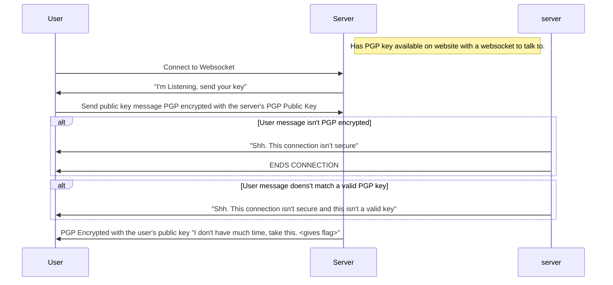

# Doubly Secure

Basic websocket connection and interaction.

```mermaid
sequenceDiagram
    participant User
    participant Server

    Note right of Server: Has PGP key available on website with a websocket to talk to.
    User ->> Server: Connect to Websocket
    Server ->> User: "I'm Listening, send your key"
    User ->> Server: Send public key message PGP encrypted with the server's PGP Public Key
    alt User message isn't PGP encrypted
    server ->> User: "Shh. This connection isn't secure"
    server ->> User: ENDS CONNECTION
    end
	alt User message doens't match a valid PGP key
	server ->> User: "Shh. This connection isn't secure and this isn't a valid key"
	end
	Server ->> User: PGP Encrypted with the user's public key "I don't have much time, take this. <gives flag>"
```
