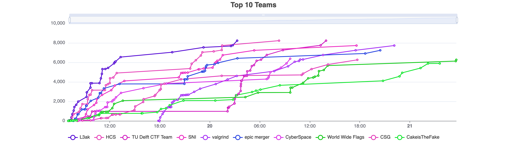
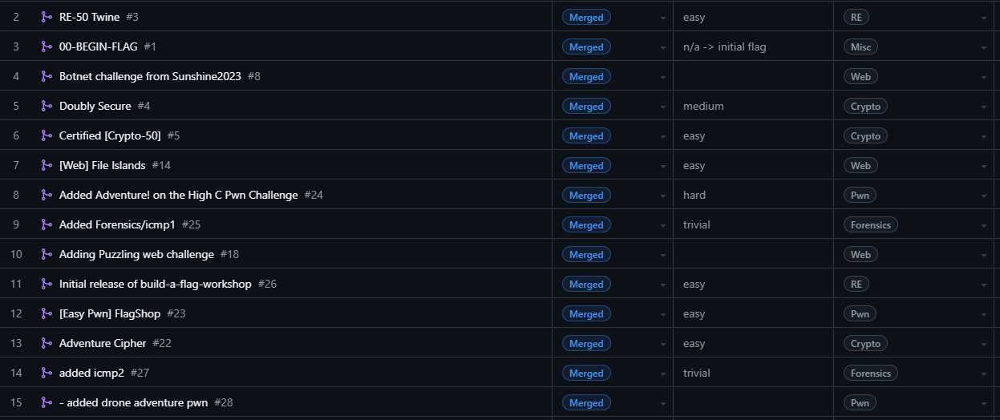

SunshineCTF 2024 Challenges
-----

This is the public release of the challenges from [SunshineCTF 2024](https://ctftime.org/event/2485).
Unless otherwise specified, all challenges are released under the MIT license.

### How to build/deploy Reversing and Pwn challenges

Install the `pwnmake` command by following the instructions located at https://github.com/C0deH4cker/PwnableHarness.

* To compile all binaries: `pwnmake`
* To build and run Docker contianers for all server-based challenges: `pwnmake docker-build`
* To publish all build artifacts that should be distributed to players into the `publish` folder: `pwnmake publish`

Each of these can be sped up by adding an argument like `-j8` to run it with 8
parallel workers.

### Challenge planning and organization

We used GitHub Projects again this year to keep track of our challenges. It is
an excellent way to see at a glance how many challenges in each category we had,
the difficulty levels of them, the development/testing status of each, and the
port numbers assigned to each challenge. This screenshot only shows some of the
challenges that actually made it to being used in the CTF.

We hope to soon migrate the challenges from this year's SunshineCTF competition
(and previous years) to a new, permanent home. More on this later!
