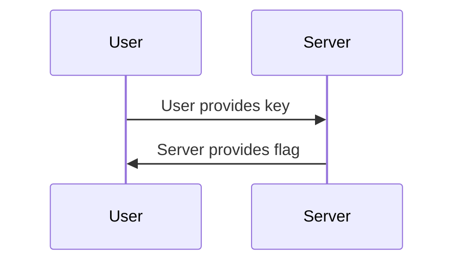

# Dungeon Keymaster

Basic Go crackme webpage.

Deploy the pre-built app in [the s3 folder](./dungeon-keymaster.2024.sunshinectf.games) to the S3 bucket. All I did was steal the binary from the container and run `strip` on it (`docker run -it --entrypoint /bin/bash -v ./:/mnt dungeon-keymaster_chal`).

Deploy the two .jpg files to the S3 bucket. Enable listing on the S3 bucket.

That way the users can get the app. Do not attach the app to the challenge description.
